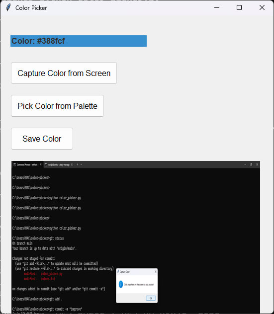

# Color Picker

Color Picker is a simple Python application built with Tkinter that allows users to capture colors from their screen, select colors from a palette, and save their chosen colors to a file. The app displays the selected color in the interface and provides an easy way to save colors for later use.

## Features

- **Capture color from screen:** Click anywhere on the screen to pick a color.
- **Select color from palette:** Open a color palette dialog to choose a color.
- **Save color:** Save the selected color to a file (`colors.txt`).
- **Display color:** The selected color is displayed in the window.



## Requirements

- Python 3.x
- Tkinter (usually included with Python)
- Pillow (`PIL`) library for image processing

You can install the required libraries using the following:

```bash
pip install -r requirements.txt
```

## Usage

1. **Run the application:**

   To run the Color Picker application, simply execute the following:
    ```
    python color_picker.py
    ```

2. **Capture color from screen:**

Click the "Capture Color from Screen" button, and then click anywhere on the screen to pick a color. The captured color will be displayed in the window.

3. **Select color from palette:**

Click the "Pick Color from Palette" button to open a color picker dialog and select a color. The selected color will be displayed in the window.

4. **Save color:**

Once you've selected a color, click the "Save Color" button to save the color to `colors.txt`.

## File Structure

```
color-picker/
│
├── color_picker.py
├── colors.txt
├── demo.jpg
├── LICENSE
├── README.md
├── requirements.txt
```

## License

MIT License.

© 2025 Max Base.
